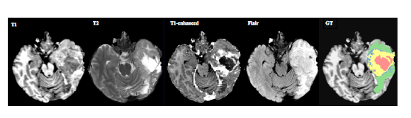
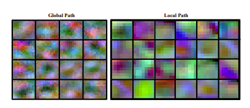
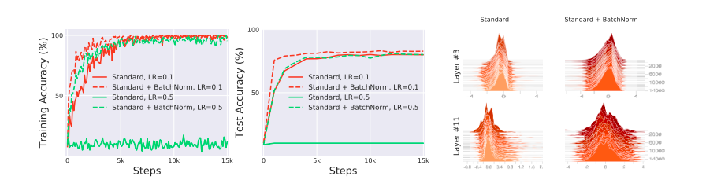
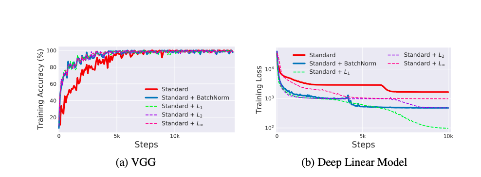

# Brain Tumour Segmentation

I have implemented the Code using Keras
Data Set will be using the Brat Data Set - https://www.smir.ch/BRATS/Start2013

## GPU
Will be using the Google Colabs for accessing powerfull GPUs

## Code author
This code belongs to Jagadish Sivakumar , developed in reference with the Jadevaibhav's Keras implementation and other online resources.

## Resources
The whole reference paper that is used in this development is https://arxiv.org/pdf/1505.03540.pdf

## Dataset
Segmentation slice by slice from axial view , due to loss of resolution in BRATS dataset in 3D.
Thus, our model processes sequentially each 2D axial image (slice) where each pixel is associated with different image modalities namely; T1, T2, T1C and
FLAIR.

Check Experiments and Results in the resource pdf to know about the BRAT dataset.
## Changes
 - The reference paper uses two-way training process but in the code 'weighted-categorical-loss' function for which weights are calculated per slice basis.
 (Two path CNN Architecture) - It has 2 paths:
 * local path - focusing on details
 * global path - focused on context
 (average of output from each path trained seperately)

 - Batch normalizations is used instead of dropouts, it smoothens optimization curve.
 Reference - https://gist.github.com/wassname/ce364fddfc8a025bfab4348cf5de852d

 
 
